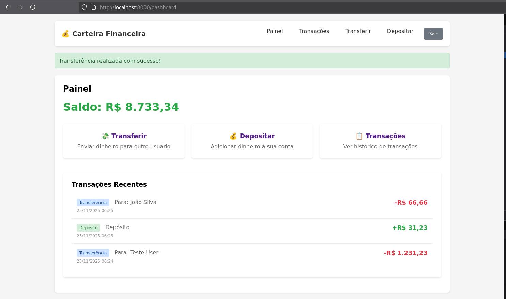

# Carteira Financeira

Sistema de carteira digital desenvolvido em Laravel que permite transferências, depósitos e gestão de saldo entre usuários.



## Tecnologias

- Laravel 12
- PHP 8.2
- MariaDB 10.11
- Docker

## Como rodar

### Desenvolvimento Local

Você só precisa ter Docker e Docker Compose instalados. Depois é só executar:

```bash
./docker-init.sh
```

Esse script faz tudo: cria o `.env`, sobe os containers, roda as migrações e seeders. Quando terminar, acesse `http://localhost:8000`.

Observação: no primeiro start o app pode demorar um pouco enquanto o Composer instala dependências dentro do container.

### Deploy em Produção (Railway.app)

Para fazer deploy em produção, consulte o guia completo: **[DEPLOY.md](DEPLOY.md)**

**Resumo rápido:**
1. Faça push do código para GitHub
2. Conecte seu repositório no [Railway.app](https://railway.app)
3. Adicione MySQL database
4. Configure variáveis de ambiente
5. Deploy automático! 🚀

## Comandos que você pode precisar

```bash
# Iniciar/parar
docker compose up -d
docker compose down

# Corrigir permissões (execute sempre que houver problemas de permissão)
./fix-permissions.sh

# Rodar comandos artisan (SEMPRE use este wrapper para evitar problemas de permissão)
./artisan-wrapper.sh migrate
./artisan-wrapper.sh make:controller NomeController
# ou manualmente (não recomendado):
docker compose exec -u www-data app php artisan [comando]

# Ver logs
docker compose logs -f app

# Entrar no container
docker compose exec app bash
```

**⚠️ Importante sobre permissões:**
- Sempre use `./artisan-wrapper.sh` para comandos artisan
- Se houver erros de permissão, execute `./fix-permissions.sh`
- Se o script pedir senha sudo, é normal - ele precisa corrigir ownership de arquivos
- Arquivos criados manualmente podem precisar de correção de permissões
- **Solução rápida**: Se persistir, execute `sudo ./fix-permissions.sh` uma vez

### Solução de Problemas (Docker)

- App reiniciando em loop (Restarting 255): normalmente é falta do `vendor/autoload.php`. O entrypoint já instala o Composer automaticamente. Confira logs:
   ```bash
   docker compose logs -n 200 app
   ```
   Se necessário, force recriação apenas do app:
   ```bash
   docker compose up -d --force-recreate app
   ```

- Erro de chave do app (permission denied em `.env` ao rodar `key:generate`): use o wrapper e/ou corrija permissões:
   ```bash
   ./fix-permissions.sh
   ./artisan-wrapper.sh key:generate --force
   ```

- Seeder duplicando emails (UniqueConstraintViolation): os seeders são idempotentes. Se o erro ocorrer vindo de um estado antigo, reexecute:
   ```bash
   ./artisan-wrapper.sh migrate --force
   ./artisan-wrapper.sh db:seed --force
   ```
   Em último caso (reset total do banco local):
   ```bash
   docker compose down -v
   ./docker-init.sh
   ```

- Porta 8000 ocupada: ajuste a porta no `docker-compose.yml` (ex.: `8080:8000`) e acesse `http://localhost:8080`.

### Reset rápido do ambiente

```bash
docker compose down
docker compose up -d mariadb
docker compose up -d app
./artisan-wrapper.sh migrate --force
./artisan-wrapper.sh db:seed --force
```

## Credenciais

**Banco de dados:**
- Host: `localhost:3307`
- Usuário: `financial_wallet_user`
- Senha: `financial_wallet_password`
- Database: `financial_wallet`

**Usuários de teste (criados automaticamente pelo seeder):**

1. **Admin User**
   - Email: `admin@exemplo.com`
   - Senha: `password`
   - Saldo inicial: `R$ 10.000,00`

2. **Teste User**
   - Email: `teste@exemplo.com`
   - Senha: `password`
   - Saldo inicial: `R$ 1.000,00`

3. **João Silva**
   - Email: `joao@exemplo.com`
   - Senha: `password`
   - Saldo inicial: `R$ 50,00`

Esses usuários são criados automaticamente quando você roda o `docker-init.sh`. Você pode usar essas credenciais para fazer login na aplicação e testar as funcionalidades.

## Testes

O projeto tem testes unitários e de integração. Para rodar:

```bash
# Todos os testes
docker compose exec app php artisan test

# Só testes unitários
docker compose exec app php artisan test --testsuite=Unit

# Só testes de integração
docker compose exec app php artisan test --testsuite=Feature
```

Atualmente temos **55 testes** cobrindo:
- Serviços de transação (transferência, depósito, estorno)
- Modelos (User, Transaction)
- Endpoints da API (autenticação, transações, wallet)
- Regras de negócio e validações

## Segurança

O sistema implementa várias camadas de segurança para proteger contra abusos e fraudes:

### Rate Limiting (Limite de Requisições)

Para evitar spam, ataques automatizados e uso abusivo do sistema, implementamos limites de requisições por tempo:

**Login e Registro:**
- **5 tentativas por minuto** por IP
- Protege contra ataques de força bruta (tentativas de adivinhar senhas)
- Se você errar a senha 5 vezes, precisa esperar 1 minuto para tentar novamente

**Transferências:**
- **5 transferências por minuto** por usuário
- **50 transferências por hora** por usuário
- Evita que alguém faça centenas de transferências em sequência (possível fraude ou erro)

**Depósitos:**
- **5 depósitos por minuto** por usuário
- **20 depósitos por hora** por usuário
- Previne automações maliciosas e uso abusivo da função de depósito

**Reversões (Estornos):**
- **3 reversões por minuto** por usuário
- **10 reversões por hora** por usuário
- Limite mais restritivo pois reversões são operações sensíveis

**API Geral:**
- **60 requisições por minuto** por usuário/IP
- Aplica-se a endpoints que não têm limite específico

**O que acontece ao exceder o limite:**
- O sistema retorna erro HTTP 429 (Too Many Requests)
- Uma mensagem informa quanto tempo você precisa esperar
- Os limites são reiniciados automaticamente após o período

**Exemplo prático:**
```
Cenário: Você tenta fazer 6 transferências em 1 minuto

1ª transferência → ✅ OK
2ª transferência → ✅ OK
3ª transferência → ✅ OK
4ª transferência → ✅ OK
5ª transferência → ✅ OK
6ª transferência → ❌ Erro 429: "Too Many Attempts. Please try again in 60 seconds."

Após 1 minuto, você pode fazer mais 5 transferências.
```

### Outras Proteções de Segurança

**Autenticação:**
- Sessões seguras com Laravel Sanctum
- CSRF protection em todos os formulários
- Hash seguro de senhas com bcrypt
- Tokens de autenticação com expiração

**Validações de Negócio:**
- Verificação de saldo antes de transferências
- Valores mínimos e máximos definidos
- Validação de existência do destinatário
- Prevenção de operações duplicadas

**Transações no Banco de Dados:**
- Transações atômicas (ACID) - tudo ou nada
- Locks para evitar condições de corrida
- Reversão automática em caso de erro
- Logs de auditoria de todas as operações

### Proteções Ativas

O sistema conta com as seguintes proteções implementadas:

- ✅ **Brute Force Protection** - Limite de 5 tentativas de login por minuto
- ✅ **Spam Prevention** - Rate limiting em todas as operações de transação
- ✅ **Fraud Detection** - Validações de saldo e limites por hora
- ✅ **DDoS Mitigation** - Rate limiting geral de 60 requisições/minuto
- ✅ **Clear Error Messages** - Retorno HTTP 429 com tempo de espera
- ✅ **CSRF Protection** - Proteção em todos os formulários
- ✅ **Secure Sessions** - Autenticação com Laravel Sanctum
- ✅ **Password Hashing** - Bcrypt com salt automático
- ✅ **SQL Injection Protection** - Eloquent ORM com prepared statements
- ✅ **Transaction Locks** - Prevenção de race conditions no banco
- ✅ **Audit Logging** - Registro de todas as operações sensíveis

## Observabilidade

O projeto tem logging estruturado e monitoramento implementado:

**Logs de transações:**
- Todas as transações são logadas em `storage/logs/transactions.log`
- Inclui informações sobre início, conclusão e falhas
- Mantém histórico por 30 dias

**Monitoramento de requisições:**
- Middleware registra todas as requisições com métricas de performance
- Logs incluem: tempo de resposta, uso de memória, status HTTP

**Health checks:**
- `/up` - Health check básico do Laravel
- `/api/health` - Health check detalhado (database, cache, tempo de resposta)

**Ver logs:**
```bash
# Logs gerais
docker compose exec app tail -f storage/logs/laravel.log

# Logs de transações
docker compose exec app tail -f storage/logs/transactions.log
```
